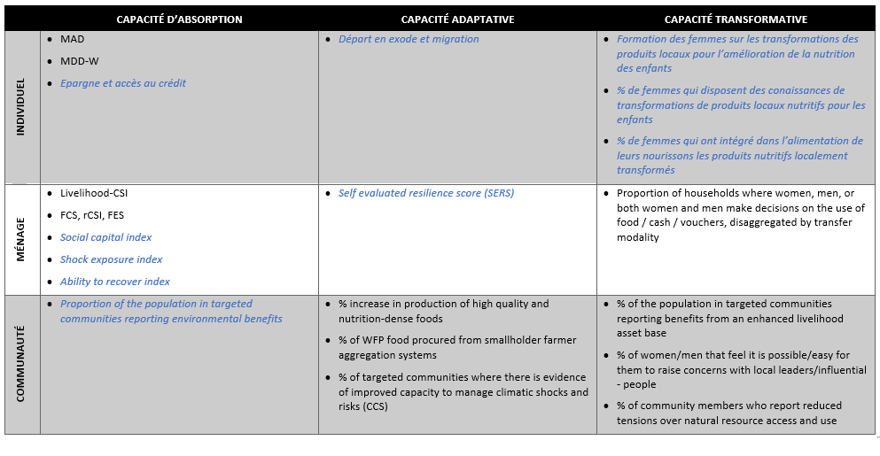

# Nouveaux indicateurs de résilience

## Logique

Le nouveau Resilience Toolkit du PAM ne prévoit pas un seul indicateur ou approche pour la mesure de la résilience au niveau corporate. Plutôt, l’approche de mesure de la résilience du PAM repose sur la logique de couvrir les différentes capacités de résilience sur lesquelles le PAM focalise ses interventions (capacités d’absorption, d’adaptation et de transformation), ainsi que les principaux niveaux d’intervention (individu, ménage et communauté) avec des indicateurs spécifiques. Le tableau ci-dessous visualise comment les indicateurs de base (en noir) et les indicateurs additionnels (en bleu) inclus dans ce guide s’inscrivent dans cette logique analytique. Pour plus de renseignements, veuillez contacter l’équipe RBD RAM (rbd.ram@wfp.org).

## Ressources pour indicateurs complémentaires

Vous trouverez ci-dessous les principales ressources pour les indicateurs additionnels inclus dans ce guide. Si vous avez des questions spécifiques sur ces indicateurs, n’hésitez pas à contacter RBD RAM (rbd.ram@wfp.org) pour plus d’informations. Veuillez aussi vous référer au Resilience Toolkit du PAM (https://resiliencetoolkit.manuals.wfp.org/en/).

**Shock Exposure Index, Ability to Recover Index & Social Capital Index (TANGO)** :
https://www.fsnnetwork.org/sites/default/files/Methodology_Guide_Nov2018508.pdf

**Asset Benefit Indicator (ABI)**: https://docs.wfp.org/api/documents/WFP-0000121064/download/

**Subjectively Evaluated Resilience Score (SERS)**: https://lindseyjonesresearchcom.files.wordpress.com/2020/09/running-the-subjectively-evaluated-resilience-score-2.pdf

## Questionnaire standardisé

### Version papier du questionnaire

Voici le module standardisé en format Word :
[RBDstandardized_questionnaire_resilience](https://github.com/WFP-VAM/RBD_Resilience_guide_FR/blob/main/questionnaires/RBDstandardized_questionnaire_resilience.docx?raw=true) 

### Version électronique du questionnaire

Voici le module standardisé en format xlsform :
[RBDstandardized_questionnaire_resilience](https://github.com/WFP-VAM/RBD_Resilience_guide_FR/blob/main/questionnaires/RBDstandardized_questionnaire_resilience.xlsx?raw=true) 

## Calcul de l'indicateur rCSI

### Exemple d'ensemble de données

Voici l'exemple d'un ensemble de données brutes :  
[exampledataFrancais_raw](https://github.com/WFP-VAM/RBD_Resilience_guide_FR/blob/main/example_datasets/exampledataFrancais_raw.sav?raw=true)  

### SPSS Syntax & R Syntax

Contactez rbd.ram@wfp.org pour toute question concernant le calcul/rapport de ces questions/indicateurs.
